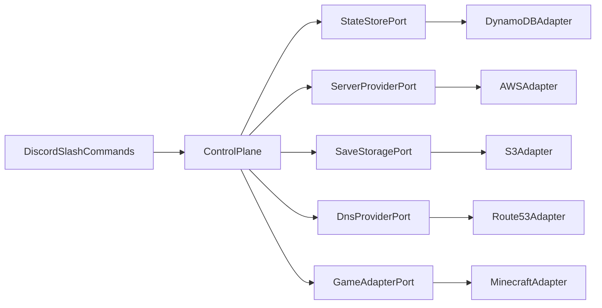

# Arquitetura lógica

Este documento é uma visão lógica da arquitetura do sistema. Define os principais componentes: **Control Plane**, **Game Server** e os **Ports & Adapters**.

## Visão geral

O **Discord** é a interface pela qual um usuário (administrador ou comum) interage com o sistema. O centro do sistema está no **Control Plane**, que orquestra provider, estado, saves, DNS e o adapter do jogo. O adapter é quem define o **Game Server** que ficará sob supervisão do Control Plane, porém totalmente independente.

A arquitetura é construída de forma que os componentes sejam bem desacoplados, de maneira que se futuramente for necessário alterar o fornecedor de uma das partes do sistema para outro, a troca não exige uma reescrita total do sistema.

## Componentes

### Control Plane

- Processo **sempre ligado**, escrito em **TypeScript + Node**
- Responsabilidades:
  - Registrar e tratar slash commands do Discord
  - Aplicar permissões (Admin vs usuário comum)
  - Garantir o **mutex global** (no máximo um Game Server ativo)
  - Orquestrar start/stop do Game Server
  - Atualizar o DNS de conexão após o Game Server subir
  - Monitorar idle e executar auto-stop
  - Persistir e ler estado via `StateStore`

### Game Server

- Sobe sob demanda via `ServerProvider`
- Desliga no `/stop` ou no auto-stop
- Disco da instância é tratado como efêmero; saves e configs sobem através do `SaveStorage`

### Ports

Foi escolhida uma arquitetura hexagonal nas fronteiras: não tratamos diretamente de implementações de fornecedores específicos (como EC2, Discord, S3) para as regras de negócio.

| Port | Responsabilidade |
| --- | --- |
| `ServerProvider` | Provisionar/iniciar/parar runtime; expor status e endereço do runtime |
| `StateStore` | Estado do sistema e configurações persistidas |
| `SaveStorage` | Upload/download de saves e configs |
| `DnsProvider` | Atualizar o registro DNS do hostname de conexão para o IP atual |
| `GameAdapter` | Contrato por jogo: start hooks, paths de save, health, configs |

### Adapters

Implementações específicas visando facilitar uma eventual migração para outro fornecedor.

| Port             | Adapter                |
| ---------------- | ---------------------- |
| `ServerProvider` | AWS                    |
| `StateStore`     | DynamoDB               |
| `SaveStorage`    | S3                     |
| `DnsProvider`    | Route 53               |
| `GameAdapter`    | Minecraft Java         |
| Interface        | Discord slash commands |

## Separação de recursos

- Control Plane e Game Server rodam como **recursos separados** na mesma conta/região AWS
- O Game Server compõe a maior partes dos custos de infra, mas que pode ser amenizado através da função de auto-stop
- Control Plane deverá ser pequeno, mas contínuo, para aceitar comandos e supervisionar o sistema

## Segurança

Há dois tipos de usuários: **administrador** e **usuário comum**. A definição de um administrador é feita através de uma role no Discord.

Comandos exclusivos para administradores:

- /start
- /stop
- /config

Comandos disponíveis para qualquer usuário:

- /status

## Fluxos principais

### Start

1. Usuário admin executa `/start`
2. Control Plane valida permissão
3. Resolve GameAdapter + configurações persistidas
4. Restaura save/configs atuais a partir de `SaveStorage`
5. `ServerProvider` sobe o runtime
6. Aguarda health do adapter
7. `DnsProvider` atualiza o hostname (Route 53) para o IP público do Game Server
8. Persiste estado (jogo, IP, hostname, iniciado em, etc.)
9. Responde no Discord com endereço de conexão e status

### Stop

1. Executado em um dos seguintes casos:
  a. Usuário admin executa `/stop`
  b. Acionado pelo processo de auto-stop
2. Encerrar processo do jogo de forma ordenada
3. Upload do save e configs através do `SaveStorage`
4. `ServerProvider` destrói/para o runtime
5. Atualiza estado → *stopped*

### Auto-stop

1. Supervisor observa ausência de jogadores (mecanismo específico do GameAdapter)
2. Ao atingir idle-timeout configurável → inicia fluxo de stop
3. Idle-timeout ajustável via `/config idle <tempo>` e persistido no `StateStore`
4. Se o valor configurado é zero, desativa o auto-stop

## Conexão dos jogadores

- Endereço canônico = **hostname** gerenciado no Route 53 (+ porta do jogo)
- O IP público do runtime é usado por baixo dos panos; no `/start` ele é publicado no DNS
