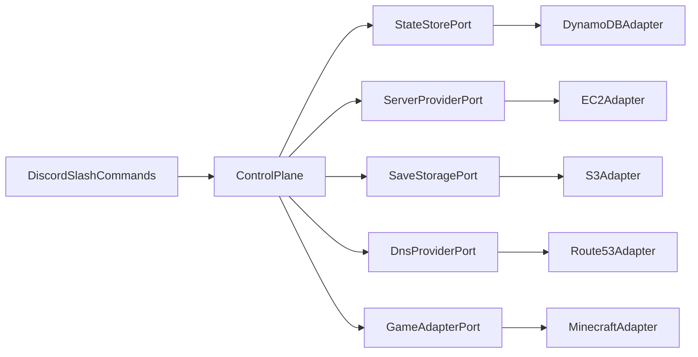
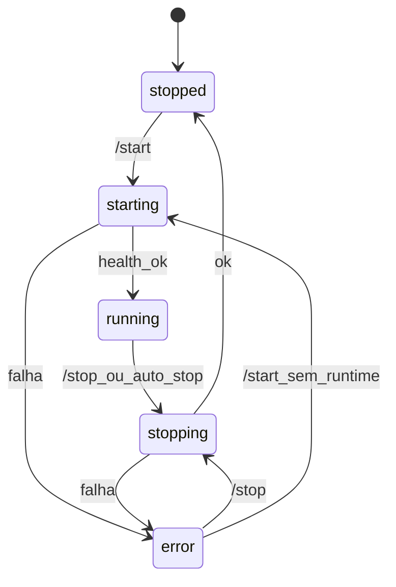

# Arquitetura lógica

Este documento é uma visão lógica da arquitetura do sistema. Define os principais componentes: **Control Plane**, **Game Server** e os **Ports & Adapters**.

## Visão geral

O **Discord** é a interface pela qual um usuário (administrador ou comum) interage com o sistema. O centro do sistema está no **Control Plane**, que orquestra provider, estado, saves, DNS e o adapter do jogo. O adapter é quem define o **Game Server** que ficará sob supervisão do Control Plane, porém totalmente independente.

A arquitetura é construída de forma que os componentes sejam bem desacoplados, de maneira que se futuramente for necessário alterar o fornecedor de uma das partes do sistema para outro, a troca não exige uma reescrita total do sistema.

## Componentes

### Control Plane

- Processo **sempre ligado**, escrito em **TypeScript + Node**
- Responsabilidades:
  - Registrar e tratar slash commands do Discord
  - Aplicar permissões (Admin vs usuário comum)
  - Garantir o **mutex global** (no máximo um Game Server ativo)
  - Orquestrar start/stop do Game Server
  - Atualizar o DNS de conexão após o Game Server subir
  - Monitorar idle e executar auto-stop
  - Persistir e ler estado via `StateStore`

### Game Server

- Sobe sob demanda via `ServerProvider` (na AWS: **EC2 On-Demand**, ADR-017)
- Desliga no `/stop` ou no auto-stop com **terminate** da instância (após upload do save)
- Disco da instância é tratado como efêmero; saves e configs sobem através do `SaveStorage`
- Bootstrap na criação via **user-data**; operação na VM via **SSM** (sem SSH público)

### Ports

Foi escolhida uma arquitetura hexagonal nas fronteiras: não tratamos diretamente de implementações de fornecedores específicos (como EC2, Discord, S3) para as regras de negócio.

| Port | Responsabilidade |
| --- | --- |
| `ServerProvider` | Provisionar/iniciar/parar runtime; expor status e endereço do runtime |
| `StateStore` | Estado do sistema e configurações persistidas |
| `SaveStorage` | Upload/download de saves e configs |
| `DnsProvider` | Atualizar o registro DNS do hostname de conexão para o IP atual |
| `GameAdapter` | Contrato por jogo: start hooks, paths de save, health, configs; canal de supervisão específico do jogo |

### Adapters

Implementações específicas visando facilitar uma eventual migração para outro fornecedor.

| Port             | Adapter                         |
| ---------------- | ------------------------------- |
| `ServerProvider` | AWS (EC2 On-Demand)             |
| `StateStore`     | DynamoDB                        |
| `SaveStorage`    | S3                              |
| `DnsProvider`    | Route 53                        |
| `GameAdapter`    | Minecraft Java                  |
| Interface        | Discord slash commands          |

## Separação de recursos

- Control Plane e Game Server rodam como **recursos separados** na mesma conta/região AWS
- O Game Server compõe a maior partes dos custos de infra, mas que pode ser amenizado através da função de auto-stop
- Control Plane deverá ser pequeno, mas contínuo, para aceitar comandos e supervisionar o sistema
- A conta AWS é provisionada via **AWS CDK (TypeScript)**; o *onde* o Control Plane roda será detalhado quando essa decisão for fechada

## Segurança

Há dois tipos de usuários: **administrador** e **usuário comum**. A definição de um administrador é feita através de uma role no Discord.

Comandos exclusivos para administradores:

- /start
- /stop
- /config

Comandos disponíveis para qualquer usuário:

- /status

## Estados do Game Server

O estado fica no `StateStore` e é o que `/status` e as pré-condições dos comandos consultam:

| Estado | Significado |
| --- | --- |
| `stopped` | Sem Game Server ativo |
| `starting` | Provisionando runtime, restaurando save/configs, health check e DNS |
| `running` | Jogo saudável; a partir daqui o Control Plane pode supervisionar o GameServer |
| `stopping` | Flush/save e derrubada do runtime em andamento |
| `error` | Falha no ciclo; `/status` explica; recuperação via `/stop` (reconcilia) e novo `/start` |

Transições principais:

Detalhes internos do provider (instância terminada, volume, etc.) não precisam aparecer como estados públicos separados.

## Fluxos principais

### Start

1. Control Plane valida permissão (admin)
2. Valida pré-condições: estado `stopped`, ou `error` sem runtime ativo; aplica mutex (falha se já houver ciclo ativo)
3. Estado → `starting` (escrita condicional no `StateStore`)
4. Resolve GameAdapter + configurações persistidas
5. `ServerProvider` sobe o runtime (EC2 `RunInstances` com user-data)
6. Restaura save/configs do `SaveStorage` **na instância**
7. GameAdapter inicia o processo do jogo (se ainda não iniciado pelo bootstrap)
8. Aguarda health do adapter
9. `DnsProvider` atualiza o hostname (Route 53) para o IP público do Game Server
10. Persiste estado (jogo, IP, hostname, iniciado em, etc.) e estado → `running`
11. Responde no Discord com endereço de conexão e status
12. Em falha: estado → `error` e mensagem no Discord

O restore não pode ocorrer antes do passo 5: não há disco/alvo de cópia enquanto o runtime não existir.

### Stop

1. Executado em um dos seguintes casos:
  a. Usuário admin executa `/stop` (pré-condição: `running` ou `error`)
  b. Acionado pelo processo de auto-stop (a partir de `running`)
2. Estado → `stopping`
3. Encerrar processo do jogo de forma ordenada (quando houver runtime)
4. Upload do save e configs através do `SaveStorage`
5. `ServerProvider` termina o runtime (EC2 `TerminateInstances`)
6. Estado → `stopped`
7. Em falha: estado → `error`

### Auto-stop

1. Supervisor observa ausência de jogadores (mecanismo específico do GameAdapter)
2. Ao atingir idle-timeout configurável → inicia fluxo de stop
3. Idle-timeout ajustável via `/config idle <tempo>` e persistido no `StateStore`
4. Se o valor configurado é zero, desativa o auto-stop

## Supervisão do Game Server

Health, presença de jogadores e flush seguro são responsabilidade do **GameAdapter** — o canal varia por jogo.

No adapter Minecraft (ADR-016), o Control Plane usa **polling RCON** para health, listagem de jogadores e comandos de save/flush. Outros adapters podem usar outro mecanismo sem alterar o núcleo.

## Concorrência e Discord

Operações de ciclo de vida (start/stop) demoram mais que o timeout síncrono de uma interação do Discord. O Control Plane:

- Responde com **deferred reply** e atualiza o resultado via **follow-up** / edição da mensagem
- Usa **escrita condicional** (ou lock equivalente) no `StateStore` para o mutex global: dois `/start` concorrentes não devem ambos entrar em `starting`
- Ignora ou rejeita com mensagem clara comandos incompatíveis com o estado atual (ex.: `/start` durante `starting` / `running`)

## Conexão dos jogadores

- Endereço canônico = **hostname** gerenciado no Route 53 (+ porta do jogo)
- O IP público do runtime é usado por baixo dos panos; no `/start` ele é publicado no DNS

## Observabilidade

- **Logs:** CloudWatch Logs (Control Plane; Game Server conforme necessidade do adapter)
- **Alarmes:** CloudWatch Alarms (ex.: Control Plane sem heartbeat; Game Server ligado além de um limiar opcional)
- **Alertas:** mensagens no Discord. Alarmes que disparam com o Control Plane caído usam um caminho mínimo com Lambda → webhook do Discord.
