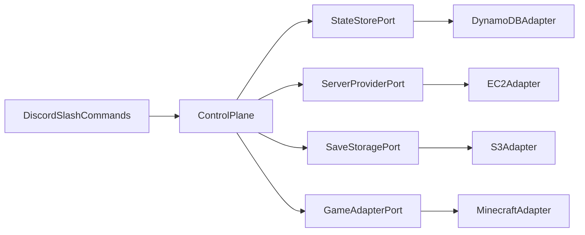
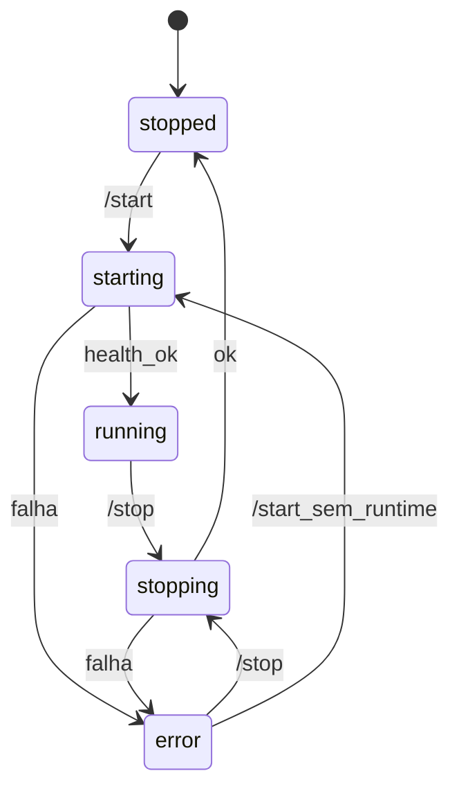

# Arquitetura lógica

Este documento é uma visão lógica da arquitetura do sistema. Define os principais componentes: **Control Plane**, **Game Server** e os **Ports & Adapters**.

## Visão geral

O **Discord** é a interface pela qual um usuário (administrador ou comum) interage com o sistema. O centro do sistema está no **Control Plane**, que orquestra provider, estado, saves e o adapter do jogo. O adapter é quem define o **Game Server** que ficará sob supervisão do Control Plane, porém totalmente independente.

A arquitetura é construída de forma que os componentes sejam bem desacoplados, de maneira que se futuramente for necessário alterar o fornecedor de uma das partes do sistema para outro, a troca não exige uma reescrita total do sistema.



## Componentes

### Control Plane

- Processo **sempre ligado**, escrito em **TypeScript + Node**
- Hospedado na AWS como **ECS Fargate**
- Responsabilidades:
  - Registrar e tratar slash commands do Discord
  - Aplicar permissões (Admin vs usuário comum)
  - Garantir o **mutex global** (no máximo um Game Server ativo)
  - Orquestrar start/stop do Game Server
  - Persistir e ler estado via `StateStore`

### Game Server

- Sobe sob demanda via `ServerProvider` (na AWS: **EC2 On-Demand**)
- Desliga no `/stop` com **terminate** da instância (após upload do save)
- Disco da instância é tratado como efêmero; saves e configs sobem através do `SaveStorage`
- Bootstrap na criação via **user-data**; operação na VM via **SSM** (sem SSH público)

### Ports

Foi escolhida uma arquitetura hexagonal nas fronteiras: não tratamos diretamente de implementações de fornecedores específicos (como EC2, Discord, S3) para as regras de negócio.

| Port | Responsabilidade |
| --- | --- |
| `ServerProvider` | Provisionar/iniciar/parar runtime; expor status e endereço do runtime |
| `StateStore` | Estado do sistema e configurações persistidas |
| `SaveStorage` | Upload/download de saves e configs |
| `GameAdapter` | Contrato por jogo: identidade, porta, saves, bootstrap e sessão de supervisão |

### Adapters

Implementações específicas visando facilitar uma eventual migração para outro fornecedor.

| Port             | Adapter                             |
| ---------------- | ----------------------------------- |
| `ServerProvider` | AWS (EC2 On-Demand)                 |
| `StateStore`     | DynamoDB                            |
| `SaveStorage`    | S3                                  |
| `GameAdapter`    | Minecraft Java                      |
| Interface        | Discord slash commands (discord.js) |

## Estrutura do repositório

Layout proposto (TypeScript / monorepo). Foco na separação de responsabilidades.

```text
/
├── apps/
│   └── control-plane/          # processo Fargate: wiring, Discord, orquestração
├── packages/
│   ├── core/                   # domínio, ports, máquina de estados
│   └── adapters/
│       ├── discord/            # slash commands via discord.js
│       ├── dynamodb/           # StateStore
│       ├── ec2/                # ServerProvider
│       ├── s3/                 # SaveStorage
│       └── minecraft/          # GameAdapter + GameSession
├── infra/                      # AWS CDK
├── docs/
├── AGENTS.md
├── CHECKLIST.md
├── README.md
└── LICENSE
```

## Separação de recursos

- Control Plane e Game Server rodam como **recursos separados** na mesma conta/região AWS: **Fargate** (Control Plane) vs **EC2** (Game Server)
- O Game Server compõe a maior parte dos custos de infra quando ligado
- Control Plane deverá ser pequeno, mas contínuo, para aceitar comandos e supervisionar o sistema
- A conta AWS é provisionada via **AWS CDK (TypeScript)**, incluindo o serviço Fargate do Control Plane

## Segurança

Há dois tipos de usuários: **administrador** e **usuário comum**. A definição de um administrador é feita através de uma role no Discord.

Comandos exclusivos para administradores:

- /start
- /stop

Comandos disponíveis para qualquer usuário:

- /status

## Estados do Game Server

O estado fica no `StateStore` e é o que `/status` e as pré-condições dos comandos consultam:

| Estado | Significado |
| --- | --- |
| `stopped` | Sem Game Server ativo |
| `starting` | Provisionando runtime, restaurando save/configs e health check |
| `running` | Jogo saudável; supervisão via `GameSession` |
| `stopping` | Flush/save e derrubada do runtime em andamento |
| `error` | Falha no ciclo; `/status` explica; recuperação via `/stop` (reconcilia) e novo `/start` |

Transições principais:



Detalhes internos do provider (instância terminada, volume, etc.) não precisam aparecer como estados públicos separados.

## Persistência de estado (`StateStore`)

Uma instalação LGHS usa **um registro principal** de ciclo de vida no DynamoDB. Schema lógico:

| Campo | Uso |
| --- | --- |
| `pk` | Chave da instalação (ex.: `INSTALL#default`) |
| `status` | `stopped` \| `starting` \| `running` \| `stopping` \| `error` |
| `gameId` | Jogo ativo ou último selecionado |
| `runtimeId` | Id da instância EC2, se houver |
| `publicIp` | IP público atual (para `/status` e resposta do `/start`) |
| `connectionPort` | Porta do jogo (do `GameAdapter`) |
| `startedAt` | Início da sessão `running` (ISO-8601), se aplicável |
| `errorMessage` | Detalhe legível quando `status = error` |
| `updatedAt` | Última transição |

## Fluxos principais

### Start

1. Control Plane valida permissão (admin)
2. Valida pré-condições: estado `stopped`, ou `error` sem runtime ativo; aplica mutex (falha se já houver ciclo ativo)
3. Estado → `starting`
4. Resolve `GameAdapter` + configurações persistidas; obtém `bootstrapPlan` e `savePaths`
5. `ServerProvider` sobe o runtime (EC2 `RunInstances` com user-data derivado do `bootstrapPlan`)
6. Bootstrap na instância: restore dos `savePaths` via `SaveStorage` + start do processo do jogo
7. `GameAdapter.connect(runtime)` → `GameSession`
8. `GameSession.waitUntilHealthy`
9. Persiste estado (jogo, IP, iniciado em, etc.) e estado → `running`
10. Responde no Discord com endereço de conexão (IP + porta) e status
11. Em falha: estado → `error` e mensagem no Discord

O restore não pode ocorrer antes do passo 5: não há disco/alvo de cópia enquanto o runtime não existir.

### Stop

1. Usuário admin executa `/stop` (pré-condição: `running` ou `error`)
2. Estado → `stopping`
3. Com runtime ativo: `GameSession.flush` e em seguida `GameSession.shutdown`
4. Upload dos `savePaths` através do `SaveStorage`
5. `ServerProvider` termina o runtime (EC2 `TerminateInstances`)
6. Estado → `stopped`
7. Em falha: estado → `error`

## Contrato do `GameAdapter`

O núcleo só fala com o port. Cada jogo implementa no mínimo:

| Elemento | Papel |
| --- | --- |
| `id` | Identificador no catálogo (ex.: `minecraft`) |
| `connectionPort` | Porta canônica para jogadores / `/status` |
| `savePaths()` | Paths relativos a sincronizar com `SaveStorage` |
| `bootstrapPlan(...)` | Plano tipado embutido no user-data pelo `ServerProvider` |
| `connect(runtime)` → `GameSession` | Sessão de supervisão no host já no ar |

`GameSession`: `waitUntilHealthy`, `flush`, `shutdown`, `playerCount`.

### `BootstrapPlan`

Estrutura tipada devolvida pelo `GameAdapter` e consumida pelo `ServerProvider`, que a **serializa em user-data** (shell/cloud-init). O núcleo não monta scripts AWS à mão.

Campos conceituais:

| Campo | Papel |
| --- | --- |
| `workingDirectory` | Diretório raiz do servidor de jogo na instância |
| `setupCommands` | Comandos de prepare (ex.: instalar Java) |
| `artifacts` | Artefatos a obter (URL ou objeto S3 → path local), ex.: jar |
| `restoreSave` | Se true, restaurar `savePaths` do `SaveStorage` antes do start |
| `startCommand` | Comando que sobe o processo do jogo |
| `env` | Variáveis de ambiente necessárias ao processo |

Detalhes de escaping/serialização ficam no adapter EC2. Timeouts de health ficam no `GameSession` / configuração do adapter.

### Divisão de responsabilidades

| Responsabilidade | Dono |
| --- | --- |
| `RunInstances` / `TerminateInstances`, SG, IP | `ServerProvider` |
| Upload/download S3 dos `savePaths()` | `SaveStorage` (acionado no bootstrap e no stop) |
| Conteúdo do bootstrap (install, binário, start) | `bootstrapPlan()` do `GameAdapter` |
| Health / flush / shutdown / players | `GameSession` do `GameAdapter` |
| Mutex e máquina de estados | Control Plane + `StateStore` |

### Supervisão

O canal de supervisão é interno ao adapter. No Minecraft, `GameSession` usa **polling RCON**. Outros jogos podem usar outro mecanismo sem alterar o núcleo.

## Concorrência e Discord

Operações de ciclo de vida (start/stop) demoram mais que o timeout síncrono de uma interação do Discord. O Control Plane:

- Responde com **deferred reply** e atualiza o resultado via **follow-up** / edição da mensagem
- Rejeita com mensagem clara comandos incompatíveis com o estado atual (ex.: `/start` durante `starting` / `running`)

Proteção extra contra corridas raras no `StateStore` fica a critério da implementação — não é requisito de desenho neste momento.

## Conexão dos jogadores

- O endereço de conexão é o **IP público** do runtime (+ porta do jogo), exposto no `/status` e na resposta do `/start`

## Observabilidade

- **Logs:** CloudWatch Logs (Control Plane; Game Server conforme necessidade do adapter)
- **Alarmes:** CloudWatch Alarms (ex.: Control Plane sem heartbeat; Game Server ligado além de um limiar opcional)
- **Alertas:** mensagens no Discord. Alarmes que disparam com o Control Plane caído usam um caminho mínimo com Lambda → webhook do Discord.
